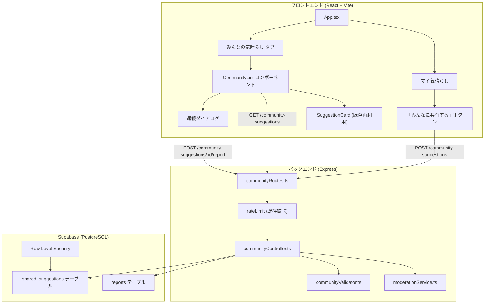
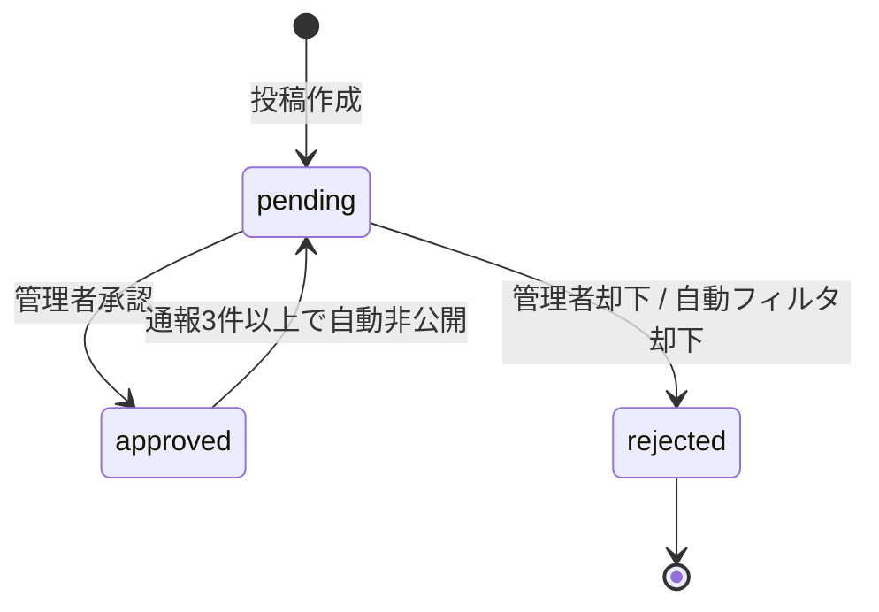
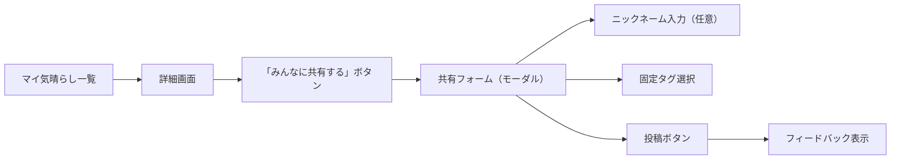

# 設計書: みんなの気晴らし（コミュニティ共有機能）

## 概要

「5分気晴らし」アプリに、ユーザーが自分の気晴らし方法をコミュニティに共有し、他のユーザーが閲覧できる機能を追加する。既存の「マイ気晴らし（CustomSuggestion）」機能を土台とし、Supabase（PostgreSQL）をバックエンドに採用する。

### 設計方針

- **既存資産の最大再利用**: `CustomSuggestion` 型、`CustomSuggestionForm` のバリデーション、`SuggestionCard` コンポーネントをそのまま活用
- **責務分離**: AI提案（Suggestion）、マイ気晴らし（CustomSuggestion）、みんなの気晴らし（SharedSuggestion）を明確に分離
- **承認制によるリスク管理**: 投稿は pending → approved/rejected のフローで管理し、不適切投稿の公開を防止
- **匿名性の維持**: ユーザー登録不要。クライアント生成の UUID をハッシュ化してサーバーに送信
- **MVPに徹する**: SNS的機能（いいね、コメント、ランキング）は排除し、投稿・閲覧・通報のみ

### なぜこの設計がMVPとして最も妥当か

1. `CustomSuggestion` → `SharedSuggestion` の変換は、既存フィールド（title, description, category, duration, steps）をそのまま引き継ぐだけで済む
2. `SuggestionCard` は `id, title, description, duration, category, steps` を受け取るため、SharedSuggestion からの変換レイヤーを1つ挟むだけで再利用可能
3. `CustomStorage.validateFormData` のバリデーションルール（タイトル100文字、説明500文字、ステップ10個、時間1〜120分）をサーバーサイドでも同一ルールとして適用
4. Supabase を使うことで、DB・RLS・REST API を一括で扱え、認証基盤の将来拡張にも対応可能
5. 既存の Express バックエンド（`/api/v1`）にルートを追加するだけで、インフラ変更が最小限

## アーキテクチャ

### システム構成図



### ストレージ戦略の比較と推奨

| 選択肢                    | メリット                                        | デメリット                               | 評価     |
| ------------------------- | ----------------------------------------------- | ---------------------------------------- | -------- |
| **Supabase (PostgreSQL)** | DB・RLS・REST API一括、無料枠あり、将来拡張容易 | 外部依存追加                             | **推奨** |
| PostgreSQL 自前運用       | 完全制御                                        | 運用コスト大、MVP向きでない              | ×        |
| Firebase / Firestore      | リアルタイム同期                                | NoSQLでリレーション弱い、RLS相当が複雑   | △        |
| localStorage 延長         | 変更なし                                        | マルチユーザー共有不可、要件を満たせない | ×        |

**推奨: Supabase（PostgreSQL）**

理由:

- 無料枠（500MB DB、50,000行）でMVPに十分
- Row Level Security で匿名ユーザーの読み取り制限を宣言的に設定可能
- Supabase JS クライアントで直接クエリも可能だが、MVPでは既存 Express 経由で統一し、将来的にクライアント直接アクセスへの移行も選択肢として残す
- PostgreSQL のインデックス・全文検索がフィルタリング・検索要件に適合

## コンポーネントとインターフェース

### フロントエンド コンポーネント構成

```
frontend/src/features/community/
├── CommunityList.tsx          # 一覧表示（メインコンポーネント）
├── CommunityShareForm.tsx     # 共有投稿フォーム（モーダル）
├── CommunityReportDialog.tsx  # 通報ダイアログ
├── CommunityTagFilter.tsx     # 固定タグフィルター
├── useCommunity.ts            # データ取得・投稿・通報のカスタムフック
└── communityApi.ts            # API クライアント
```

#### CommunityList（一覧表示）

- 承認済み SharedSuggestion を新着順で表示
- 既存 `SuggestionCard` を再利用（SharedSuggestion → Suggestion 変換後に渡す）
- 固定タグフィルター、キーワード検索、無限スクロール（ページネーション）を提供
- 通報ボタンを各カードに追加

#### CommunityShareForm（共有投稿フォーム）

- `CustomSuggestionForm` のバリデーションロジックを再利用
- 追加フィールド: ニックネーム（任意）、固定タグ選択（複数可）
- CustomSuggestion のデータ（title, description, category, duration, steps）を初期値として自動入力

#### CommunityReportDialog（通報ダイアログ）

- 通報理由の選択肢: 不適切な内容、スパム、その他
- 送信後にフィードバックメッセージを表示

### バックエンド コンポーネント構成

```
backend/src/
├── api/
│   ├── routes/
│   │   └── communityRoutes.ts       # ルーティング定義
│   ├── controllers/
│   │   └── communityController.ts   # リクエスト処理
│   └── middleware/
│       └── rateLimit.ts             # 既存ファイルに追加
├── services/
│   ├── community/
│   │   ├── communityValidator.ts    # バリデーション
│   │   ├── moderationService.ts     # モデレーション（禁止語チェック）
│   │   ├── sanitizer.ts            # サニタイズ処理
│   │   └── supabaseClient.ts       # Supabase クライアント初期化
│   └── ...
└── ...
```

### API 設計

#### 1. POST /api/v1/community-suggestions（投稿作成）

```typescript
// Request
interface CreateSharedSuggestionRequest {
  title: string; // 1〜100文字
  description: string; // 1〜500文字
  category: "認知的" | "行動的";
  duration: number; // 1〜120（分）
  steps: string[]; // 0〜10個
  fixed_tags: FixedTag[]; // 0〜8個（定義済みタグから選択）
  nickname?: string; // 任意、1〜20文字、デフォルト「名無しさん」
  author_hash: string; // SHA-256 ハッシュ（64文字の16進数文字列）
}

// Response (201 Created)
interface CreateSharedSuggestionResponse {
  data: {
    id: string;
    moderation_status: "pending" | "rejected";
    created_at: string;
  };
  message: string; // 「投稿しました。承認後に公開されます」or 自動却下メッセージ
}
```

**バリデーション:**

- title: 必須、1〜100文字、トリム後
- description: 必須、1〜500文字、トリム後
- category: `認知的` または `行動的` のみ
- duration: 整数、1〜120
- steps: 配列、0〜10要素、各要素は空でない文字列
- fixed_tags: 定義済みタグリストに含まれる値のみ
- nickname: 省略可、1〜20文字
- author_hash: 必須、64文字の16進数文字列（SHA-256）
- ペイロード全体: 10KB以内

**エラーケース:**

- 400: バリデーションエラー（フィールドごとのエラーメッセージ付き）
- 413: ペイロードサイズ超過
- 429: レートリミット超過（1時間あたり5件）

**レート制限:** 同一 author_hash から1時間あたり5件

**認可/識別:** author_hash をキーとして識別。認証は不要。

#### 2. GET /api/v1/community-suggestions（一覧取得）

```typescript
// Query Parameters
interface GetSharedSuggestionsQuery {
  page?: number; // デフォルト 1
  limit?: number; // デフォルト 20、最大 50
  tag?: FixedTag; // 固定タグでフィルタ
  search?: string; // キーワード検索（title, description）
  sort?: "newest"; // MVPでは新着順のみ
}

// Response (200 OK)
interface GetSharedSuggestionsResponse {
  data: SharedSuggestionListItem[];
  pagination: {
    page: number;
    limit: number;
    total: number;
    has_next: boolean;
  };
}

interface SharedSuggestionListItem {
  id: string;
  title: string;
  description: string;
  category: "認知的" | "行動的";
  duration: number;
  steps: string[];
  fixed_tags: FixedTag[];
  nickname: string;
  created_at: string;
}
```

**バリデーション:**

- page: 正の整数
- limit: 1〜50の整数
- tag: 定義済みタグリストに含まれる値
- search: 1〜100文字

**エラーケース:**

- 400: 不正なクエリパラメータ

**レート制限:** 通常の API レート制限（既存の `rateLimiter.suggestions` を適用）

**認可/識別:** 認証不要。RLS により approved のみ返却。

#### 3. POST /api/v1/community-suggestions/:id/report（通報）

```typescript
// Request
interface CreateReportRequest {
  reason: "不適切な内容" | "スパム" | "その他";
  author_hash: string; // 通報者の識別子
}

// Response (201 Created)
interface CreateReportResponse {
  data: {
    id: string;
    created_at: string;
  };
  message: string; // 「通報を受け付けました」
}
```

**バリデーション:**

- reason: 定義済みの3値のみ
- author_hash: 必須、64文字の16進数文字列
- 対象の SharedSuggestion が存在し、approved 状態であること

**エラーケース:**

- 400: バリデーションエラー
- 404: 対象の SharedSuggestion が存在しない
- 409: 同一 author_hash からの重複通報
- 429: レートリミット超過（1時間あたり10件）

**レート制限:** 同一 author_hash から1時間あたり10件

**認可/識別:** author_hash をキーとして識別。

#### 4. GET /api/v1/community-suggestions/tags（タグ一覧取得）

```typescript
// Response (200 OK)
interface GetTagsResponse {
  data: FixedTag[];
}
```

静的な定義済みタグリストを返却。クライアント側でハードコードしても良いが、将来のタグ追加に備えて API として提供。

#### 5. 管理用 API（MVP判断: 最小限で含める）

MVP では Supabase Dashboard での直接操作を主とするが、最低限の承認 API を提供する。

```typescript
// PATCH /api/v1/admin/community-suggestions/:id/moderate
// ※ 管理者トークン（環境変数で設定）による簡易認証
interface ModerateSuggestionRequest {
  status: "approved" | "rejected";
  reason?: string; // 却下理由（任意）
}

// Response (200 OK)
interface ModerateSuggestionResponse {
  data: {
    id: string;
    moderation_status: "approved" | "rejected";
    updated_at: string;
  };
}
```

**認可:** `Authorization: Bearer <ADMIN_TOKEN>` ヘッダーで簡易認証。`ADMIN_TOKEN` は環境変数で設定。

## データモデル

### SharedSuggestion（共有投稿）

```typescript
interface SharedSuggestion {
  id: string; // UUID v4（Supabase が自動生成）
  title: string; // 1〜100文字
  description: string; // 1〜500文字
  category: "認知的" | "行動的";
  duration: number; // 1〜120（分）
  steps: string[]; // 0〜10個の手順
  fixed_tags: FixedTag[]; // 固定タグ（0〜8個）
  author_hash: string; // SHA-256 ハッシュ化された匿名識別子
  nickname: string; // 表示名（デフォルト「名無しさん」）
  moderation_status: ModerationStatus;
  moderation_reason?: string; // 却下理由（管理者が設定）
  report_count: number; // 通報件数
  created_at: string; // ISO 8601
  updated_at: string; // ISO 8601
}
```

### ModerationStatus（承認状態）

```typescript
type ModerationStatus = "pending" | "approved" | "rejected";
```

状態遷移:



### Report（通報）

```typescript
interface Report {
  id: string; // UUID v4
  shared_suggestion_id: string; // 対象の SharedSuggestion ID（外部キー）
  reporter_hash: string; // 通報者の author_hash
  reason: ReportReason;
  created_at: string; // ISO 8601
}

type ReportReason = "不適切な内容" | "スパム" | "その他";
```

### FixedTag（固定タグ）

```typescript
type FixedTag =
  | "リラックス"
  | "運動"
  | "呼吸法"
  | "マインドフルネス"
  | "創作"
  | "音楽"
  | "自然"
  | "コミュニケーション";

const FIXED_TAGS: FixedTag[] = [
  "リラックス",
  "運動",
  "呼吸法",
  "マインドフルネス",
  "創作",
  "音楽",
  "自然",
  "コミュニケーション",
];
```

### Suggestion との責務分離

| モデル             | 責務                                               | ストレージ             | ソース                 |
| ------------------ | -------------------------------------------------- | ---------------------- | ---------------------- |
| `Suggestion`       | AI提案・フォールバック提案の表示用インターフェース | なし（API レスポンス） | バックエンド AI / JSON |
| `CustomSuggestion` | ユーザー個人の気晴らし（ローカル保存）             | localStorage           | ユーザー入力           |
| `SharedSuggestion` | コミュニティ共有用の気晴らし（サーバー保存）       | Supabase PostgreSQL    | ユーザー投稿           |

### 変換レイヤー

```typescript
// SharedSuggestion → Suggestion 互換オブジェクトへの変換
function toSuggestion(shared: SharedSuggestionListItem): Suggestion {
  return {
    id: shared.id,
    title: shared.title,
    description: shared.description,
    category: shared.category,
    duration: shared.duration,
    steps: shared.steps,
    dataSource: "community" as DataSource, // 新しい DataSource 値を追加
  };
}

// Suggestion 互換オブジェクトから SharedSuggestion の共通フィールドを復元
function fromSuggestion(
  suggestion: Suggestion,
): Pick<
  SharedSuggestion,
  "title" | "description" | "category" | "duration" | "steps"
> {
  return {
    title: suggestion.title,
    description: suggestion.description,
    category: suggestion.category,
    duration: suggestion.duration,
    steps: suggestion.steps ?? [],
  };
}
```

### PostgreSQL テーブル定義

```sql
-- shared_suggestions テーブル
CREATE TABLE shared_suggestions (
  id UUID PRIMARY KEY DEFAULT gen_random_uuid(),
  title TEXT NOT NULL CHECK (char_length(title) BETWEEN 1 AND 100),
  description TEXT NOT NULL CHECK (char_length(description) BETWEEN 1 AND 500),
  category TEXT NOT NULL CHECK (category IN ('認知的', '行動的')),
  duration INTEGER NOT NULL CHECK (duration BETWEEN 1 AND 120),
  steps JSONB NOT NULL DEFAULT '[]'::jsonb,
  fixed_tags JSONB NOT NULL DEFAULT '[]'::jsonb,
  author_hash TEXT NOT NULL CHECK (char_length(author_hash) = 64),
  nickname TEXT NOT NULL DEFAULT '名無しさん' CHECK (char_length(nickname) BETWEEN 1 AND 20),
  moderation_status TEXT NOT NULL DEFAULT 'pending' CHECK (moderation_status IN ('pending', 'approved', 'rejected')),
  moderation_reason TEXT,
  report_count INTEGER NOT NULL DEFAULT 0,
  created_at TIMESTAMPTZ NOT NULL DEFAULT now(),
  updated_at TIMESTAMPTZ NOT NULL DEFAULT now()
);

-- インデックス
CREATE INDEX idx_shared_suggestions_status_created ON shared_suggestions (moderation_status, created_at DESC);
CREATE INDEX idx_shared_suggestions_author ON shared_suggestions (author_hash);
CREATE INDEX idx_shared_suggestions_tags ON shared_suggestions USING GIN (fixed_tags);

-- updated_at 自動更新トリガー
CREATE OR REPLACE FUNCTION update_updated_at()
RETURNS TRIGGER AS $$
BEGIN
  NEW.updated_at = now();
  RETURN NEW;
END;
$$ LANGUAGE plpgsql;

CREATE TRIGGER trigger_updated_at
  BEFORE UPDATE ON shared_suggestions
  FOR EACH ROW EXECUTE FUNCTION update_updated_at();

-- reports テーブル
CREATE TABLE reports (
  id UUID PRIMARY KEY DEFAULT gen_random_uuid(),
  shared_suggestion_id UUID NOT NULL REFERENCES shared_suggestions(id) ON DELETE CASCADE,
  reporter_hash TEXT NOT NULL CHECK (char_length(reporter_hash) = 64),
  reason TEXT NOT NULL CHECK (reason IN ('不適切な内容', 'スパム', 'その他')),
  created_at TIMESTAMPTZ NOT NULL DEFAULT now(),
  UNIQUE (shared_suggestion_id, reporter_hash)  -- 同一ユーザーからの重複通報防止
);

CREATE INDEX idx_reports_suggestion ON reports (shared_suggestion_id);

-- Row Level Security
ALTER TABLE shared_suggestions ENABLE ROW LEVEL SECURITY;
ALTER TABLE reports ENABLE ROW LEVEL SECURITY;

-- 匿名ユーザーは approved のみ読み取り可能
CREATE POLICY "approved_read" ON shared_suggestions
  FOR SELECT USING (moderation_status = 'approved');

-- 匿名ユーザーは投稿作成可能
CREATE POLICY "anon_insert" ON shared_suggestions
  FOR INSERT WITH CHECK (moderation_status = 'pending');

-- 通報は作成のみ可能
CREATE POLICY "anon_report_insert" ON reports
  FOR INSERT WITH CHECK (true);

-- サービスロール（バックエンド）は全操作可能
-- ※ Supabase のサービスロールキーを使用する場合、RLS をバイパス
```

### モデレーション設計

#### 自動チェック（投稿時）

```typescript
interface ModerationResult {
  passed: boolean;
  reason?: string;
  flaggedWords?: string[];
}

// 禁止語リストによる自動フィルタリング
function checkModeration(text: string): ModerationResult {
  // 1. NGワードチェック（暴言、差別用語、性的表現）
  // 2. 危険行為チェック（自傷、薬物、医療的断定）
  // 3. スパムパターンチェック（URL連続、同一文字の繰り返し）
  // 4. 誹謗中傷パターンチェック
}
```

**禁止語カテゴリ:**

- 暴言・差別用語
- 性的表現
- 自傷・自殺に関する表現
- 薬物・違法行為
- 医療的断定（「〜で治る」「〜すれば必ず〜」等）
- スパムパターン（URL、連続同一文字）

**フロー:**

1. 投稿受信 → サニタイズ → バリデーション → 自動モデレーション
2. 自動モデレーションで NG → `rejected` に設定（管理者確認不要）
3. 自動モデレーションで OK → `pending` に設定（管理者確認待ち）
4. 管理者が `pending` を確認 → `approved` or `rejected`

**誤検知/見逃し時の方針:**

- 誤検知（正常な投稿が rejected）: 管理者が Supabase Dashboard で手動で `approved` に変更可能
- 見逃し（不適切な投稿が pending → approved）: 通報機能で対応。3件以上の通報で自動非公開（`pending` に戻す）
- 禁止語リストは定期的に見直し、必要に応じて更新

**医療的断定・危険行為を避けるルール:**

- 「〜で治る」「〜すれば必ず改善する」等の医療的断定表現を禁止語に含める
- 「薬を飲む」「断食する」等の医療行為・危険行為に関する表現をフラグ
- あくまで気晴らし（リラクゼーション）の範囲に留まる投稿のみ承認

### 匿名識別子の管理

```typescript
// クライアント側
const ANON_ID_KEY = "kibarashi_anonymous_id";

function getOrCreateAnonymousId(): string {
  let id = localStorage.getItem(ANON_ID_KEY);
  if (!id) {
    id = crypto.randomUUID(); // UUID v4
    localStorage.setItem(ANON_ID_KEY, id);
  }
  return id;
}

async function hashAnonymousId(id: string): Promise<string> {
  const encoder = new TextEncoder();
  const data = encoder.encode(id);
  const hashBuffer = await crypto.subtle.digest("SHA-256", data);
  const hashArray = Array.from(new Uint8Array(hashBuffer));
  return hashArray.map((b) => b.toString(16).padStart(2, "0")).join("");
}
```

- 平文の UUID はクライアントの localStorage にのみ保存
- サーバーには SHA-256 ハッシュ値のみ送信
- localStorage が削除された場合、新しい UUID が生成される（以前の投稿との紐付けは失われる）

### UI/UX 設計

#### 「みんなの気晴らし」画面の位置づけ

- 既存の `App.tsx` の `Step` 型に `'community'` を追加
- `BottomNavigation` または `MainLayout` のヘッダーナビに「みんなの気晴らし」タブを追加
- AI提案の主導線（状況選択 → 時間選択 → 提案表示）には一切影響しない
- 3タップ以内でアクセス可能（ホーム → ナビタブ → 一覧表示）

#### 投稿導線



#### 投稿フォーム設計

- CustomSuggestion のデータを自動入力（title, description, category, duration, steps）
- 追加入力: ニックネーム（任意、プレースホルダー「名無しさん」）、固定タグ（チップ選択UI）
- バリデーションは `CustomStorage.validateFormData` と同等のルールを適用
- 投稿成功時: 「投稿しました。承認後に公開されます」のトースト表示
- 投稿失敗時: エラーメッセージ + 再試行ボタン

#### 一覧表示

- 新着順（created_at DESC）
- フィルタ: 固定タグ（チップ選択）、キーワード検索（テキスト入力）
- 各カードは `SuggestionCard` を再利用し、追加で「ニックネーム」「タグ」「通報ボタン」を表示
- 無限スクロール（Intersection Observer API）
- ローディング状態、エラー状態、空状態のUI

#### AI提案とコミュニティ投稿を混ぜない理由

1. **信頼性の差異**: AI提案は品質管理されたコンテンツ、コミュニティ投稿はユーザー生成コンテンツ。混在するとユーザーが情報源を区別できない
2. **UXの一貫性**: AI提案は「状況 → 時間 → 提案」のフローで表示される。コミュニティ投稿は自由閲覧。導線が異なる
3. **モデレーションリスク**: 未承認・不適切な投稿がAI提案と並んで表示されるリスクを排除
4. **シンプルさ**: タブで明確に分離することで、ユーザーが「今何を見ているか」を常に把握できる

## 正確性プロパティ（Correctness Properties）

_プロパティとは、システムのすべての有効な実行において成り立つべき特性や振る舞いのことです。人間が読める仕様と、機械で検証可能な正確性保証の橋渡しとなります。_

### Property 1: SharedSuggestion ↔ Suggestion 変換のラウンドトリップ

*任意の*有効な SharedSuggestion オブジェクトに対して、`toSuggestion` で Suggestion 互換オブジェクトに変換し、`fromSuggestion` で共通フィールドを復元した場合、元の `title`, `description`, `category`, `duration`, `steps` が一致する。

**Validates: Requirements 3.3, 7.3, 8.2, 8.4**

### Property 2: バリデーションの冪等性

*任意の*投稿データ（有効・無効の両方を含む）に対して、バリデーション関数を1回適用した結果と2回適用した結果が同一である。

**Validates: Requirements 1.6, 7.6**

### Property 3: フィルタリングのメタモルフィックプロパティ

_任意の_ SharedSuggestion リストと FixedTag に対して、タグフィルタリング後の結果は (a) 全て指定タグを含み、(b) 件数がフィルタ前以下である。同様に、*任意の*キーワードによる検索結果は、全て title または description にキーワードを含む。

**Validates: Requirements 3.4, 3.5**

### Property 4: レートリミットの不変条件

_任意の_ Anonymous_Author_ID と投稿リクエスト列に対して、1時間以内に受理された投稿数は常に5件以下である。同様に、通報リクエストについては1時間以内に10件以下である。

**Validates: Requirements 6.1, 6.5**

### Property 5: サニタイズのラウンドトリップ安全性と冪等性

*任意の*文字列に対して、サニタイズ関数を適用した結果には HTML タグおよびスクリプトタグが含まれない。かつ、サニタイズ関数を2回適用した結果は1回適用した結果と同一である。

**Validates: Requirements 6.2**

### Property 6: 通報による自動非公開の不変条件

_任意の_ SharedSuggestion に対して、`report_count` が3以上になった場合、`moderation_status` は `approved` ではない。

**Validates: Requirements 5.3**

### Property 7: 禁止語チェックの正確性

*任意の*テキストに対して、禁止語リストに含まれる語句がテキスト内に存在する場合、モデレーション関数は `passed: false` を返す。禁止語を含まないテキストに対しては `passed: true` を返す。

**Validates: Requirements 4.5, 4.6**

### Property 8: 一覧取得は承認済みのみ

_任意の_ SharedSuggestion リスト（pending, approved, rejected 混在）に対して、一覧取得 API の返却結果に含まれる全ての投稿の `moderation_status` は `approved` である。かつ、結果は `created_at` の降順でソートされている。

**Validates: Requirements 3.1, 3.2, 4.2**

## エラーハンドリング

### フロントエンド

| エラー種別                     | 対応                                                         |
| ------------------------------ | ------------------------------------------------------------ |
| API 通信エラー（ネットワーク） | エラーメッセージ + 再試行ボタン表示                          |
| 400 バリデーションエラー       | フィールドごとのエラーメッセージ表示                         |
| 409 重複通報                   | 「すでに通報済みです」メッセージ表示                         |
| 429 レートリミット             | 「しばらく時間をおいてから再度お試しください」メッセージ表示 |
| 413 ペイロード超過             | 「投稿データが大きすぎます」メッセージ表示                   |
| 500 サーバーエラー             | 汎用エラーメッセージ + 再試行ボタン                          |
| Supabase 接続エラー            | 汎用エラーメッセージ（ユーザーには詳細を見せない）           |

### バックエンド

既存の `errorHandler.ts` を再利用し、コミュニティ機能固有のエラーを追加:

```typescript
// コミュニティ機能固有のエラー
class CommunityError extends Error {
  constructor(
    message: string,
    public statusCode: number,
    public isOperational: boolean = true,
  ) {
    super(message);
    this.name = "CommunityError";
  }
}

// 使用例
throw new CommunityError("同一の投稿に対して既に通報済みです", 409);
throw new CommunityError("投稿が見つかりません", 404);
throw new CommunityError("レートリミットを超過しました", 429);
```

### Supabase エラー

- 接続エラー: リトライ（最大3回、指数バックオフ）後にエラーレスポンス
- RLS 違反: 403 として処理（ログに記録）
- 制約違反（重複通報等）: 409 として処理

## テスト戦略

### テストフレームワーク

- **ユニットテスト / プロパティテスト**: Vitest（既存プロジェクトで使用中）
- **プロパティベーステスト**: [fast-check](https://github.com/dubzzz/fast-check)（Vitest と統合可能）
- **API テスト**: Supertest（既存プロジェクトで使用中）
- **UI テスト**: @testing-library/react（既存プロジェクトで使用中）

### デュアルテストアプローチ

#### ユニットテスト（具体例・エッジケース・エラー条件）

| テスト対象         | テスト内容                                                                                      |
| ------------------ | ----------------------------------------------------------------------------------------------- |
| バリデーション     | 正常系（有効データ）、異常系（空文字、上限超過、不正な型）、境界値（0文字、100文字、101文字等） |
| サニタイズ         | `<script>` タグ除去、HTML エンティティ、Unicode 文字、空文字列                                  |
| モデレーション     | 禁止語検出、安全なテキスト通過、医療的断定検出                                                  |
| 変換レイヤー       | toSuggestion / fromSuggestion の具体例                                                          |
| API エンドポイント | 正常系レスポンス、各エラーコード、レートリミット                                                |
| 通報処理           | 通報作成、重複拒否、3件で自動非公開                                                             |
| 匿名識別子         | UUID 生成、SHA-256 ハッシュ化、localStorage 操作                                                |
| UI コンポーネント  | CommunityList 表示、フィルタ操作、通報ダイアログ、エラー状態                                    |

#### プロパティベーステスト（普遍的プロパティ）

| プロパティ                       | テスト設定                                                                                                                          |
| -------------------------------- | ----------------------------------------------------------------------------------------------------------------------------------- |
| Property 1: ラウンドトリップ     | 最低100イテレーション。生成: title(1〜100文字), description(1〜500文字), category(認知的\|行動的), duration(1〜120), steps(0〜10個) |
| Property 2: バリデーション冪等性 | 最低100イテレーション。生成: 有効・無効の両方を含む任意の投稿データ                                                                 |
| Property 3: フィルタリング       | 最低100イテレーション。生成: 0〜50件の SharedSuggestion リスト、任意の FixedTag / キーワード                                        |
| Property 4: レートリミット       | 最低100イテレーション。生成: 1〜20件の投稿リクエスト列、任意のタイムスタンプ                                                        |
| Property 5: サニタイズ           | 最低100イテレーション。生成: HTML タグ・スクリプトタグ・通常テキスト・Unicode を含む任意の文字列                                    |
| Property 6: 通報自動非公開       | 最低100イテレーション。生成: 0〜10件の通報を持つ SharedSuggestion                                                                   |
| Property 7: 禁止語チェック       | 最低100イテレーション。生成: 禁止語を含む/含まない任意のテキスト                                                                    |
| Property 8: 一覧取得             | 最低100イテレーション。生成: pending/approved/rejected 混在の SharedSuggestion リスト                                               |

**プロパティテストのタグ形式:**

```
Feature: community-sharing, Property {number}: {property_text}
```

### 既存機能回帰テスト

- AI 提案フロー（状況選択 → 時間選択 → 提案表示）が正常に動作すること
- マイ気晴らし（CustomSuggestion）の CRUD が正常に動作すること
- SuggestionCard の既存表示が壊れていないこと
- BottomNavigation / MainLayout の既存動作が維持されること

### テスト実行コマンド

```bash
# フロントエンド
cd frontend && npx vitest run

# バックエンド
cd backend && npx vitest run

# カバレッジ付き
cd frontend && npx vitest run --coverage
cd backend && npx vitest run --coverage
```
