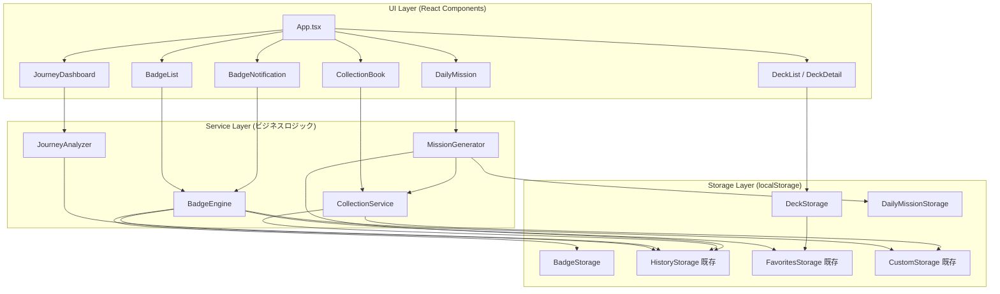

# 技術設計ドキュメント: 穏やかなゲーミフィケーション（Gentle Gamification）

## 概要

kibarashi-app に「穏やかなゲーミフィケーション」機能を追加する。本機能は、バッジシステム、回復ジャーニー（利用傾向分析）、お気に入りデッキ、図鑑、デイリーミッションの5つのサブ機能で構成される。

既存アーキテクチャ（React + TypeScript + Vite + Tailwind CSS、localStorage ベースのデータ永続化、feature-based ディレクトリ構成）に準拠し、フロントエンド完結で実装する。バックエンドへの変更は不要。

設計原則として、競争させない・失敗扱いしない・休んだ日を罰しない・自己理解を報酬化する・課金前提の報酬設計禁止を厳守する。

## アーキテクチャ

### 既存アーキテクチャとの整合

kibarashi-app は以下の構成を持つ:

- フロントエンド: React 18 + TypeScript + Vite + Tailwind CSS
- データ永続化: localStorage（`HistoryStorage`, `FavoritesStorage`, `CustomStorage` クラス）
- ディレクトリ構成: `frontend/src/features/` 配下に機能単位でディレクトリを分割
- 型定義: `frontend/src/types/` に集約
- ストレージサービス: `frontend/src/services/storage/` に集約
- ナビゲーション: `App.tsx` の `Step` 型による画面切り替え（react-router-dom は未使用の状態遷移ベース）
- テスト: Vitest + React Testing Library

### 新機能の配置

```
frontend/src/
├── types/
│   ├── badge.ts              # バッジ関連の型定義
│   ├── deck.ts               # デッキ関連の型定義
│   ├── collection.ts         # 図鑑関連の型定義
│   ├── dailyMission.ts       # デイリーミッション関連の型定義
│   └── journey.ts            # 回復ジャーニー関連の型定義
├── services/
│   ├── storage/
│   │   ├── badgeStorage.ts        # バッジデータの永続化
│   │   ├── deckStorage.ts         # デッキデータの永続化
│   │   └── dailyMissionStorage.ts # デイリーミッションデータの永続化
│   └── gamification/
│       ├── badgeEngine.ts         # バッジ解除判定ロジック
│       ├── journeyAnalyzer.ts     # 回復ジャーニー分析ロジック
│       ├── collectionService.ts   # 図鑑データ集約ロジック
│       └── missionGenerator.ts    # デイリーミッション生成ロジック
├── features/
│   ├── badge/
│   │   ├── BadgeList.tsx          # バッジ一覧画面
│   │   ├── BadgeCard.tsx          # 個別バッジ表示
│   │   └── BadgeNotification.tsx  # バッジ解除通知
│   ├── journey/
│   │   ├── JourneyDashboard.tsx   # 回復ジャーニーダッシュボード
│   │   ├── WeeklySummary.tsx      # 今週のサマリー
│   │   ├── CategoryAnalysis.tsx   # 効果的なカテゴリ分析
│   │   └── TimePatternChart.tsx   # 時間帯・所要時間の傾向
│   ├── deck/
│   │   ├── DeckList.tsx           # デッキ一覧画面
│   │   ├── DeckDetail.tsx         # デッキ詳細画面
│   │   └── DeckForm.tsx           # デッキ作成・編集フォーム
│   ├── collection/
│   │   └── CollectionBook.tsx     # 図鑑画面
│   └── mission/
│       └── DailyMission.tsx       # デイリーミッション表示
```

### アーキテクチャ図



### 設計判断

1. フロントエンド完結: 既存アプリが localStorage ベースであり、バックエンド不要の設計を維持する
2. 既存データ活用: `HistoryStorage.getHistory()` と `HistoryStorage.getStats()` を最大限活用し、新たなデータ収集は行わない
3. Service Layer 分離: UI コンポーネントからビジネスロジックを分離し、テスタビリティを確保する
4. 既存 Storage パターン踏襲: `static` メソッドベースの Storage クラスパターンを踏襲する

## コンポーネントとインターフェース

### BadgeEngine（バッジ解除判定エンジン）

```typescript
// frontend/src/services/gamification/badgeEngine.ts

export class BadgeEngine {
  /** 全バッジ定義を取得 */
  static getBadgeDefinitions(): BadgeDefinition[];

  /** 現在のユーザー行動データからバッジ解除状態を評価 */
  static evaluateBadges(): BadgeEvaluationResult;

  /** 特定のアクション後に新たに解除されたバッジを検出 */
  static checkNewUnlocks(): UnlockedBadge[];
}
```

### JourneyAnalyzer（回復ジャーニー分析）

```typescript
// frontend/src/services/gamification/journeyAnalyzer.ts

export class JourneyAnalyzer {
  /** 今週のサマリーを生成 */
  static getWeeklySummary(): JourneySummary;

  /** 直近2週間の効果的なカテゴリを分析 */
  static getEffectiveCategories(): CategoryAnalysisResult;

  /** 直近2週間の利用時間帯・所要時間の傾向を分析 */
  static getTimePatterns(): TimePatternResult;

  /** 利用傾向に基づく意味のあるメッセージを生成 */
  static generateInsightMessage(summary: JourneySummary): string;
}
```

### CollectionService（図鑑データ集約）

```typescript
// frontend/src/services/gamification/collectionService.ts

export class CollectionService {
  /** 全気晴らしの図鑑エントリーを取得 */
  static getCollectionEntries(): CollectionEntry[];

  /** 試行済み・未試行の統計を取得 */
  static getCollectionStats(): CollectionStats;
}
```

### MissionGenerator（デイリーミッション生成）

```typescript
// frontend/src/services/gamification/missionGenerator.ts

export class MissionGenerator {
  /** 当日のミッションを取得（未生成なら生成） */
  static getTodayMission(): DailyMission;

  /** ミッション達成判定 */
  static checkMissionCompletion(mission: DailyMission): boolean;
}
```

### Storage クラス

```typescript
// frontend/src/services/storage/badgeStorage.ts
export class BadgeStorage {
  static getUnlockedBadges(): UnlockedBadgeData;
  static unlockBadge(badgeId: string): boolean;
  static isUnlocked(badgeId: string): boolean;
  static markNotificationSeen(badgeId: string): boolean;
}

// frontend/src/services/storage/deckStorage.ts
export class DeckStorage {
  static getDecks(): DeckData;
  static addDeck(name: string, description?: string): Deck | null;
  static updateDeck(
    id: string,
    updates: Partial<Pick<Deck, "name" | "description">>,
  ): boolean;
  static deleteDeck(id: string): boolean;
  static addItemToDeck(deckId: string, favoriteId: string): boolean;
  static removeItemFromDeck(deckId: string, favoriteId: string): boolean;
}

// frontend/src/services/storage/dailyMissionStorage.ts
export class DailyMissionStorage {
  static getTodayMission(): StoredMission | null;
  static saveMission(mission: StoredMission): boolean;
  static updateMissionStatus(status: "completed" | "expired"): boolean;
}
```

## データモデル

### バッジ関連

```typescript
// frontend/src/types/badge.ts

/** バッジカテゴリ */
export type BadgeCategory = "first_step" | "exploration" | "engagement";

/** バッジ定義 */
export interface BadgeDefinition {
  id: string;
  name: string;
  description: string;
  category: BadgeCategory;
  /** 解除条件を評価する関数名（BadgeEngine 内で使用） */
  conditionKey: string;
  /** 未解除時に表示するヒント */
  hint: string;
}

/** 解除済みバッジ */
export interface UnlockedBadge {
  badgeId: string;
  unlockedAt: string; // ISO 8601
  notificationSeen: boolean;
}

/** バッジストレージデータ */
export interface UnlockedBadgeData {
  badges: UnlockedBadge[];
  lastUpdated: string;
}

/** バッジ評価結果 */
export interface BadgeEvaluationResult {
  unlocked: UnlockedBadge[];
  locked: BadgeDefinition[];
  newlyUnlocked: BadgeDefinition[];
}
```

### 初期バッジ定義

| ID                     | 名前               | 説明                                     | カテゴリ    | 解除条件             |
| ---------------------- | ------------------ | ---------------------------------------- | ----------- | -------------------- |
| `first_try`            | はじめの一歩       | 初めての気晴らしを完了しました           | first_step  | 完了履歴 ≥ 1         |
| `three_completed`      | 3つの体験          | 3回の気晴らしを完了しました              | first_step  | 完了履歴 ≥ 3         |
| `both_categories_used` | 両方の世界         | 認知的・行動的の両カテゴリを体験しました | exploration | 各カテゴリの完了 ≥ 1 |
| `favorite_saved`       | お気に入り発見     | お気に入りを登録しました                 | engagement  | お気に入り ≥ 1       |
| `note_written`         | 振り返りの記録     | メモを記録しました                       | engagement  | メモ付き履歴 ≥ 1     |
| `custom_created`       | 自分だけの気晴らし | カスタム気晴らしを作成しました           | exploration | カスタム ≥ 1         |

### 回復ジャーニー関連

```typescript
// frontend/src/types/journey.ts

/** 今週のサマリー */
export interface JourneySummary {
  periodStart: string; // ISO 8601（月曜日）
  periodEnd: string; // ISO 8601（現在）
  executionCount: number;
  completionCount: number;
  totalDurationSeconds: number;
  insightMessage: string;
}

/** カテゴリ分析結果 */
export interface CategoryAnalysisResult {
  hasEnoughData: boolean; // 3件以上のデータがあるか
  categories: CategoryEffectiveness[];
  message: string;
}

export interface CategoryEffectiveness {
  category: "認知的" | "行動的";
  averageRating: number;
  count: number;
}

/** 時間帯区分 */
export type TimeSlot = "朝" | "昼" | "夕方" | "夜";

/** 所要時間区分 */
export type DurationRange = "5分以内" | "5〜15分" | "15分以上";

/** 時間帯・所要時間の傾向 */
export interface TimePatternResult {
  hasEnoughData: boolean;
  frequentTimeSlot: TimeSlot | null;
  effectiveDurationRange: DurationRange | null;
  message: string;
}
```

### デッキ関連

```typescript
// frontend/src/types/deck.ts

/** デッキ */
export interface Deck {
  id: string;
  name: string;
  description?: string;
  favoriteIds: string[]; // Favorite.id の配列
  createdAt: string;
  updatedAt: string;
}

/** デッキストレージデータ */
export interface DeckData {
  decks: Deck[];
  lastUpdated: string;
}
```

### 図鑑関連

```typescript
// frontend/src/types/collection.ts

/** 図鑑エントリー */
export interface CollectionEntry {
  suggestionId: string;
  title: string;
  description: string;
  category: "認知的" | "行動的";
  duration: number;
  tried: boolean;
  firstTriedAt?: string; // ISO 8601
}

/** 図鑑統計 */
export interface CollectionStats {
  totalCount: number;
  triedCount: number;
}
```

### デイリーミッション関連

```typescript
// frontend/src/types/dailyMission.ts

/** ミッション種別 */
export type MissionType =
  | "try_suggestion"
  | "try_category"
  | "write_note"
  | "try_new";

/** デイリーミッション */
export interface DailyMission {
  id: string;
  date: string; // YYYY-MM-DD
  type: MissionType;
  title: string;
  description: string; // 提案的な語調
  targetSuggestionId?: string; // 特定の気晴らしを提案する場合
  targetCategory?: "認知的" | "行動的";
  completed: boolean;
  completedAt?: string;
}

/** ミッションストレージデータ */
export interface StoredMission {
  mission: DailyMission;
  lastUpdated: string;
}
```

### localStorage キー一覧

| キー                           | 用途                     | Storage クラス      |
| ------------------------------ | ------------------------ | ------------------- |
| `kibarashi_history`            | 実行履歴（既存）         | HistoryStorage      |
| `kibarashi-favorites`          | お気に入り（既存）       | FavoritesStorage    |
| `kibarashi_custom_suggestions` | カスタム気晴らし（既存） | CustomStorage       |
| `kibarashi_badges`             | 解除済みバッジ           | BadgeStorage        |
| `kibarashi_decks`              | デッキデータ             | DeckStorage         |
| `kibarashi_daily_mission`      | デイリーミッション       | DailyMissionStorage |
