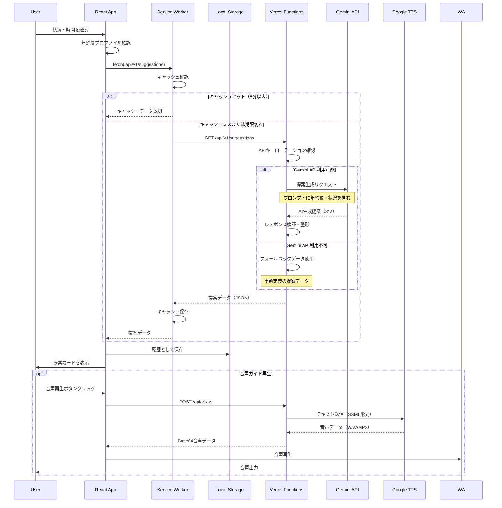
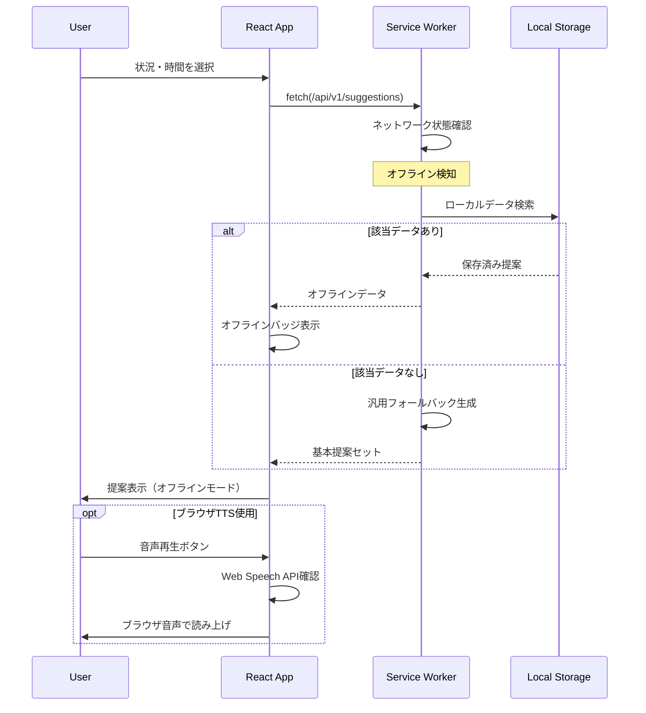
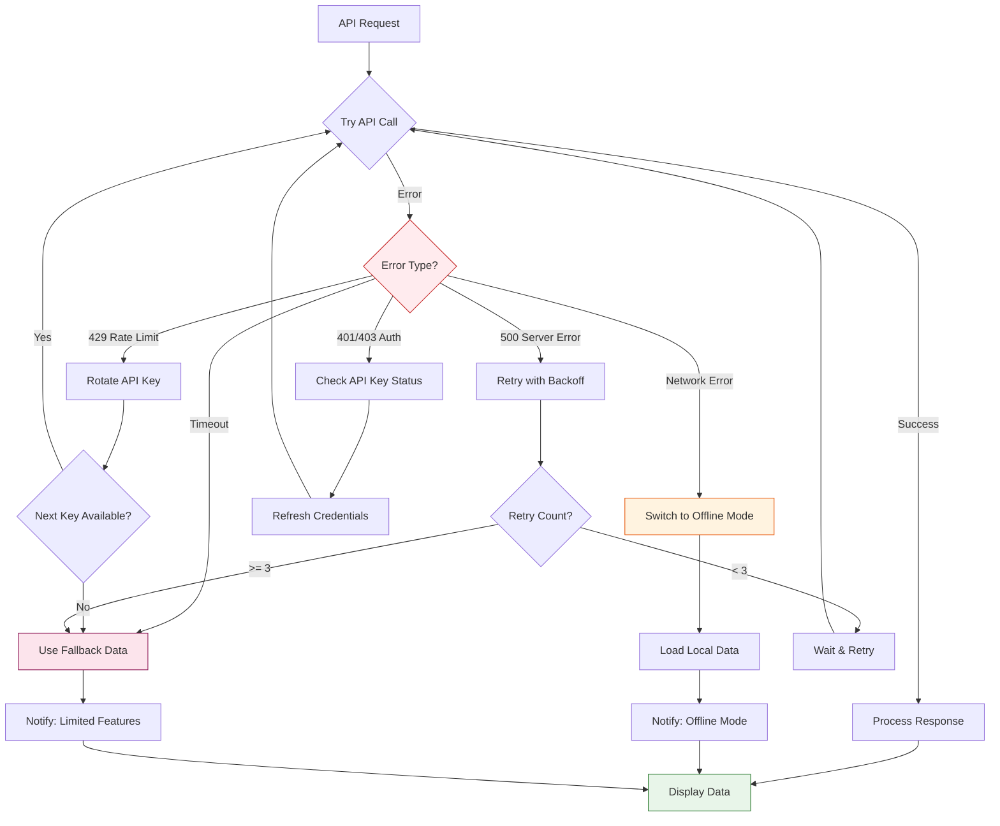
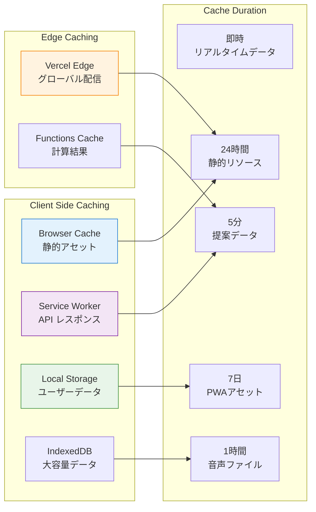
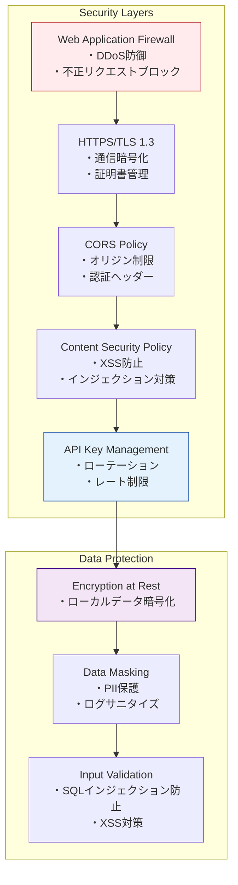
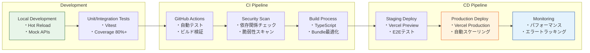

# 5分気晴らしアプリ アーキテクチャ設計書

## 概要

本ドキュメントは、5分気晴らしアプリ（kibarashi-app）のシステムアーキテクチャを定義します。PWA対応のReactフロントエンドとVercel Functionsベースのサーバーレスバックエンドを中心に、外部APIとの統合を含む全体構成を説明します。

## システム全体図

```mermaid
graph TB
    subgraph "Client Layer (PWA)"
        UI[React UI Components<br/>・状況/時間選択<br/>・提案表示<br/>・音声再生制御]
        SW[Service Worker<br/>・オフライン対応<br/>・キャッシュ管理<br/>・バックグラウンド同期]
        LS[Local Storage/IndexedDB<br/>・お気に入り保存<br/>・履歴記録<br/>・統計データ]
        WA[Web Audio API<br/>・音声再生<br/>・ボリューム制御<br/>・再生状態管理]
        
        UI --> SW
        UI --> LS
        UI --> WA
    end
    
    subgraph "Network Layer"
        CDN[CDN (Vercel Edge Network)<br/>・静的アセット配信<br/>・音声ファイルキャッシュ<br/>・グローバル配信]
        API[API Gateway<br/>Vercel Functions<br/>・ルーティング<br/>・レート制限]
    end
    
    subgraph "Backend Layer (Vercel Functions)"
        VF1[/api/v1/suggestions<br/>気晴らし提案生成<br/>・年齢層対応<br/>・フォールバック]
        VF2[/api/v1/enhanced-suggestions<br/>拡張提案<br/>・音声ガイド付き<br/>・詳細ステップ]
        VF3[/api/v1/tts<br/>音声合成<br/>・テキスト変換<br/>・音声設定]
        VF4[/api/v1/health<br/>ヘルスチェック<br/>・API状態確認<br/>・環境情報]
        
        Cache[In-Memory Cache<br/>・提案キャッシュ<br/>・APIレスポンス<br/>・一時データ]
        
        VF1 --> Cache
        VF2 --> Cache
    end
    
    subgraph "External Services"
        GEMINI[Gemini API<br/>・AI提案生成<br/>・プロンプト処理<br/>・多様性確保]
        TTS[Google Cloud TTS<br/>・音声合成<br/>・SSML対応<br/>・多言語対応]
        VERCEL[Vercel Platform<br/>・ホスティング<br/>・Functions実行<br/>・自動スケーリング]
    end
    
    %% Client to Network connections
    UI -->|HTTPS/HTTP2| API
    UI -->|HTTPS/HTTP2| CDN
    SW -->|Cache First| CDN
    SW -->|Network First| API
    
    %% API Gateway routing
    API --> VF1
    API --> VF2
    API --> VF3
    API --> VF4
    
    %% Backend to External
    VF1 -->|REST API| GEMINI
    VF2 -->|REST API| GEMINI
    VF3 -->|gRPC/REST| TTS
    
    %% Response flow
    GEMINI -->|JSON Response| VF1
    GEMINI -->|JSON Response| VF2
    TTS -->|Audio Stream| VF3
    VF1 -->|Suggestions JSON| API
    VF2 -->|Enhanced JSON| API
    VF3 -->|Base64 Audio| API
    API -->|JSON/Binary| UI
    
    %% Offline support
    LS -.->|Offline Mode| UI
    SW -.->|Cached Data| UI
    
    %% Deployment
    VERCEL -->|Deploy| API
    VERCEL -->|Host| CDN
    
    classDef client fill:#e1f5fe,stroke:#01579b,stroke-width:2px
    classDef backend fill:#f3e5f5,stroke:#4a148c,stroke-width:2px
    classDef external fill:#fff3e0,stroke:#e65100,stroke-width:2px
    classDef network fill:#e8f5e9,stroke:#1b5e20,stroke-width:2px
    
    class UI,SW,LS,WA client
    class VF1,VF2,VF3,VF4,Cache backend
    class GEMINI,TTS,VERCEL external
    class CDN,API network
```

## データフロー

### 1. オンライン時の提案取得フロー



### 2. オフライン時のフォールバックフロー



## エラーハンドリングアーキテクチャ



## キャッシュ戦略

### キャッシュレイヤー構成



### キャッシュ無効化戦略

1. **時間ベース無効化**
   - 提案データ: 5分後に自動無効化
   - 音声データ: 1時間保持
   - 静的アセット: ビルドハッシュで管理

2. **イベントベース無効化**
   - ユーザープロファイル変更時
   - 新バージョンデプロイ時
   - 手動リフレッシュ操作時

3. **容量ベース無効化**
   - Local Storage: 5MB制限
   - IndexedDB: 50MB制限
   - LRU（Least Recently Used）アルゴリズム

## セキュリティアーキテクチャ

### セキュリティレイヤー



## デプロイメントアーキテクチャ

### CI/CDパイプライン



## スケーラビリティ考慮事項

### 現在の構成（Phase 1-3）
- **ユーザー数**: 〜50万人
- **同時接続**: 〜5,000
- **API呼び出し**: 〜100,000/日

### 将来の拡張計画（Phase 4+）
1. **データベース層の追加**
   - PostgreSQL（ユーザーデータ永続化）
   - Redis（セッションキャッシュ）

2. **マイクロサービス化**
   - 提案生成サービス
   - 音声処理サービス
   - 分析サービス

3. **グローバル展開**
   - マルチリージョン対応
   - 言語別コンテンツ配信
   - 地域別フォールバック

## パフォーマンス目標

### Core Web Vitals
- **LCP (Largest Contentful Paint)**: < 2.5s
- **FID (First Input Delay)**: < 100ms
- **CLS (Cumulative Layout Shift)**: < 0.1

### API レスポンスタイム
- **提案取得**: < 500ms（キャッシュヒット時 < 50ms）
- **音声生成**: < 1000ms
- **ヘルスチェック**: < 100ms

## モニタリング・可観測性

### メトリクス収集
- **フロントエンド**: Web Vitals、エラー率、ユーザー行動
- **バックエンド**: レスポンスタイム、API使用率、エラー率
- **インフラ**: CPU使用率、メモリ使用量、ネットワーク帯域

### ログ管理
- **構造化ログ**: JSON形式
- **ログレベル**: ERROR, WARN, INFO, DEBUG
- **保持期間**: 30日（コンプライアンス要件に応じて調整）

---

最終更新: 2025-01-07