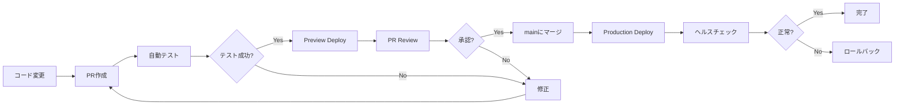

# 5分気晴らしアプリ デプロイメント手順書

## 概要

本ドキュメントは、5分気晴らしアプリ（kibarashi-app）のデプロイメント手順を詳細に説明します。Vercelを使用したサーバーレスデプロイメントとGitHub Actionsによる自動化されたCI/CDパイプラインを中心に構成されています。

## 目次

1. [前提条件](#前提条件)
2. [デプロイメントアーキテクチャ](#デプロイメントアーキテクチャ)
3. [初回セットアップ](#初回セットアップ)
4. [環境変数の設定](#環境変数の設定)
5. [デプロイメント手順](#デプロイメント手順)
6. [CI/CDパイプライン](#cicdパイプライン)
7. [トラブルシューティング](#トラブルシューティング)
8. [ロールバック手順](#ロールバック手順)
9. [監視とアラート](#監視とアラート)

## 前提条件

### 必要なアカウント
- GitHubアカウント
- Vercelアカウント（GitHubと連携済み）
- Google Cloud Platformアカウント（APIキー取得済み）

### 必要なツール
```bash
# Node.js 18.x以上
node --version

# npm 9.x以上
npm --version

# Git
git --version

# Vercel CLI（オプション）
npm i -g vercel
```

### APIキー準備
- Google Gemini API キー（複数推奨）
- Google Cloud Text-to-Speech API キー
- Vercelアクセストークン（自動デプロイ用）

## デプロイメントアーキテクチャ

```
┌─────────────┐     ┌─────────────┐     ┌──────────────┐
│   GitHub    │────▶│   Vercel    │────▶│ Production   │
│   (main)    │     │   Build     │     │ Environment  │
└─────────────┘     └─────────────┘     └──────────────┘
      │                    │                     │
      │                    │                     ├─ React App (CDN)
      ▼                    ▼                     ├─ API Functions
 GitHub Actions       Preview URLs               └─ Edge Network
      │                    │
      ├─ Tests             └─ PR Reviews
      ├─ Lint
      └─ Security
```

## 初回セットアップ

### 1. プロジェクトのフォーク/クローン

```bash
# リポジトリのクローン
git clone https://github.com/your-username/kibarashi-app.git
cd kibarashi-app

# 依存関係のインストール
npm install
```

### 2. Vercelプロジェクトの作成

#### A. Vercel Webダッシュボードを使用

1. [Vercel Dashboard](https://vercel.com/dashboard)にログイン
2. "New Project"をクリック
3. GitHubリポジトリを選択
4. プロジェクト名を設定（例: `kibarashi-app`）
5. Framework Presetは"Other"を選択
6. Build設定：
   - Build Command: `cd frontend && npm install && npm run build`
   - Output Directory: `frontend/dist`
   - Install Command: `npm install`

#### B. Vercel CLIを使用

```bash
# Vercel CLIでログイン
vercel login

# プロジェクトのセットアップ
vercel

# プロンプトに従って設定
# - Link to existing project? No
# - What's your project's name? kibarashi-app
# - In which directory is your code located? ./
# - Want to modify these settings? Yes
#   - Build Command: cd frontend && npm install && npm run build
#   - Output Directory: frontend/dist
#   - Development Command: cd frontend && npm run dev
```

### 3. GitHub Secrets設定

GitHub リポジトリの Settings > Secrets and variables > Actions で以下を設定：

```yaml
# 必須シークレット
VERCEL_TOKEN: your-vercel-token
VERCEL_ORG_ID: your-vercel-org-id
VERCEL_PROJECT_ID: your-vercel-project-id
GEMINI_API_KEY_1: first-gemini-api-key
GEMINI_API_KEY_2: second-gemini-api-key
GEMINI_API_KEY_3: third-gemini-api-key
GOOGLE_CLOUD_TTS_KEY: your-tts-api-key
```

## 環境変数の設定

### Vercel環境変数

Vercel Dashboard > Project Settings > Environment Variables で設定：

#### Production環境変数

```bash
# Gemini API キー（ローテーション用）
GEMINI_API_KEY_1=your-first-api-key
GEMINI_API_KEY_2=your-second-api-key
GEMINI_API_KEY_3=your-third-api-key

# Google Cloud TTS
GOOGLE_CLOUD_TTS_KEY=your-tts-api-key

# アプリケーション設定
NODE_ENV=production
API_VERSION=v1
ENABLE_RATE_LIMIT=true
RATE_LIMIT_WINDOW=900000  # 15分（ミリ秒）
RATE_LIMIT_MAX_REQUESTS=100

# CORS設定
CORS_ORIGIN=https://kibarashi-app.com

# キャッシュ設定
CACHE_TTL=300  # 5分（秒）
```

#### Preview環境変数

Production環境変数に加えて：

```bash
# デバッグ設定
DEBUG_MODE=true
LOG_LEVEL=debug

# Preview環境用のCORS
CORS_ORIGIN=*
```

### ローカル開発環境

```bash
# backend/.env.example をコピー
cp backend/.env.example backend/.env

# .env ファイルを編集
vim backend/.env
```

## デプロイメント手順

### 1. 自動デプロイ（推奨）

mainブランチへのプッシュで自動デプロイ：

```bash
# featureブランチで開発
git checkout -b feature/your-feature

# 変更をコミット
git add .
git commit -m "feat: 新機能の追加"

# プルリクエストを作成
git push origin feature/your-feature

# GitHub上でPRを作成・マージ
# → 自動的にVercelがデプロイ
```

### 2. 手動デプロイ

#### A. Vercel CLIを使用

```bash
# Production環境へデプロイ
vercel --prod

# Preview環境へデプロイ
vercel
```

#### B. GitHub Actionsを使用

```bash
# タグを作成してプッシュ
git tag v1.0.0
git push origin v1.0.0

# → deploy-vercel.yml が実行される
```

### 3. API Functions のデプロイ

Vercel Functions（`/api` ディレクトリ）は自動的にデプロイされます：

```
api/
├── v1/
│   ├── health.ts       → https://your-app.vercel.app/api/v1/health
│   ├── suggestions.ts  → https://your-app.vercel.app/api/v1/suggestions
│   └── tts.ts         → https://your-app.vercel.app/api/v1/tts
```

## CI/CDパイプライン

### GitHub Actions ワークフロー

#### 1. CI（継続的インテグレーション）

`.github/workflows/ci.yml`:

```yaml
name: CI

on:
  push:
    branches: [main, develop]
  pull_request:
    branches: [main]

jobs:
  test:
    runs-on: ubuntu-latest
    steps:
      - uses: actions/checkout@v4
      - uses: actions/setup-node@v4
        with:
          node-version: '18'
          cache: 'npm'
      
      - name: Install dependencies
        run: npm ci
      
      - name: Run linting
        run: |
          cd frontend && npm run lint
          cd ../backend && npm run lint
      
      - name: Run tests
        run: |
          cd frontend && npm run test
          cd ../backend && npm run test
      
      - name: Build check
        run: |
          cd frontend && npm run build
```

#### 2. 自動デプロイ

`.github/workflows/deploy-vercel.yml`:

```yaml
name: Deploy to Vercel

on:
  push:
    branches: [main]
  workflow_dispatch:

jobs:
  deploy:
    runs-on: ubuntu-latest
    steps:
      - uses: actions/checkout@v4
      
      - name: Deploy to Vercel
        uses: amondnet/vercel-action@v25
        with:
          vercel-token: ${{ secrets.VERCEL_TOKEN }}
          vercel-org-id: ${{ secrets.VERCEL_ORG_ID }}
          vercel-project-id: ${{ secrets.VERCEL_PROJECT_ID }}
          vercel-args: '--prod'
```

### デプロイメントフロー



## トラブルシューティング

### よくある問題と解決方法

#### 1. ビルドエラー

```bash
# エラー: Cannot find module エラー
解決: 
npm ci  # package-lock.json から正確に再インストール

# エラー: Build failed
解決:
1. ローカルでビルドを確認
   cd frontend && npm run build
2. Node.js バージョンを確認
3. 環境変数を確認
```

#### 2. API Functions エラー

```bash
# エラー: 404 Not Found on API routes
解決:
1. api/ ディレクトリ構造を確認
2. vercel.json の rewrites 設定を確認
3. 関数のエクスポートを確認（export default）

# エラー: 環境変数が undefined
解決:
1. Vercel Dashboard で環境変数を確認
2. 環境変数名のタイポを確認
3. Preview/Production 環境の違いを確認
```

#### 3. デプロイメント失敗

```bash
# エラー: Deployment failed
解決:
1. Vercel Dashboard でビルドログを確認
2. GitHub Actions のログを確認
3. vercel.json の設定を検証
```

### デバッグコマンド

```bash
# Vercel CLI でログ確認
vercel logs

# 関数のログを確認
vercel logs --filter function

# ビルド出力の確認
vercel build --debug

# 環境変数の確認（マスクされた値）
vercel env ls
```

## ロールバック手順

### 1. Vercel Dashboard からロールバック

1. Vercel Dashboard > Deployments タブ
2. 安定していた以前のデプロイメントを選択
3. "..." メニュー > "Promote to Production"
4. 確認してプロモート

### 2. Git を使用したロールバック

```bash
# 直前のコミットに戻す
git revert HEAD
git push origin main

# 特定のコミットに戻す
git revert <commit-hash>
git push origin main

# 緊急時：強制的に以前の状態に戻す
git reset --hard <stable-commit-hash>
git push --force origin main  # 注意：履歴が変更される
```

### 3. API バージョンの切り替え

```javascript
// 一時的に古いAPIバージョンを使用
// vercel.json で設定
{
  "env": {
    "API_VERSION": "v1-stable"
  }
}
```

## 監視とアラート

### 1. Vercel Analytics

- Real User Monitoring (RUM)
- Web Vitals 監視
- エラー率の追跡

### 2. カスタムモニタリング

```javascript
// api/v1/health.ts のヘルスチェック
export default async function handler(req, res) {
  const health = {
    status: 'healthy',
    timestamp: new Date().toISOString(),
    version: process.env.API_VERSION,
    checks: {
      gemini: await checkGeminiAPI(),
      tts: await checkTTSAPI(),
      redis: await checkRedisConnection()
    }
  };
  
  res.status(200).json(health);
}
```

### 3. アラート設定

GitHub Actions でヘルスチェック：

```yaml
name: Health Check

on:
  schedule:
    - cron: '*/15 * * * *'  # 15分ごと

jobs:
  health-check:
    runs-on: ubuntu-latest
    steps:
      - name: Check API Health
        run: |
          response=$(curl -s https://kibarashi-app.vercel.app/api/v1/health)
          if [[ $(echo $response | jq -r '.status') != "healthy" ]]; then
            echo "API is unhealthy!"
            exit 1
          fi
```

## ベストプラクティス

### 1. デプロイメント前チェックリスト

- [ ] すべてのテストがパスしている
- [ ] Lintエラーがない
- [ ] ビルドが成功する
- [ ] 環境変数が正しく設定されている
- [ ] APIキーのローテーションが有効
- [ ] セキュリティスキャンをパス

### 2. 段階的デプロイ

1. feature ブランチ → Preview環境
2. レビュー・テスト
3. develop ブランチ → Staging環境
4. 最終確認
5. main ブランチ → Production環境

### 3. 環境変数管理

```bash
# 環境変数のバックアップ
vercel env pull .env.production

# チーム間での共有
# .env.example を更新して必要な変数をドキュメント化
```

## 緊急時対応

### 1. 緊急ホットフィックス

```bash
# mainから直接ブランチを作成
git checkout main
git pull origin main
git checkout -b hotfix/critical-bug

# 修正を実装
# ...

# 直接mainにマージ（レビューを簡略化）
git push origin hotfix/critical-bug
# GitHub上で緊急PRを作成・マージ
```

### 2. 一時的なメンテナンスモード

```javascript
// api/v1/_middleware.ts
export function middleware(request) {
  if (process.env.MAINTENANCE_MODE === 'true') {
    return new Response(
      JSON.stringify({
        error: 'メンテナンス中です',
        message: 'しばらくお待ちください'
      }),
      {
        status: 503,
        headers: {
          'Content-Type': 'application/json',
          'Retry-After': '3600'
        }
      }
    );
  }
}
```

---

最終更新: 2025-01-07